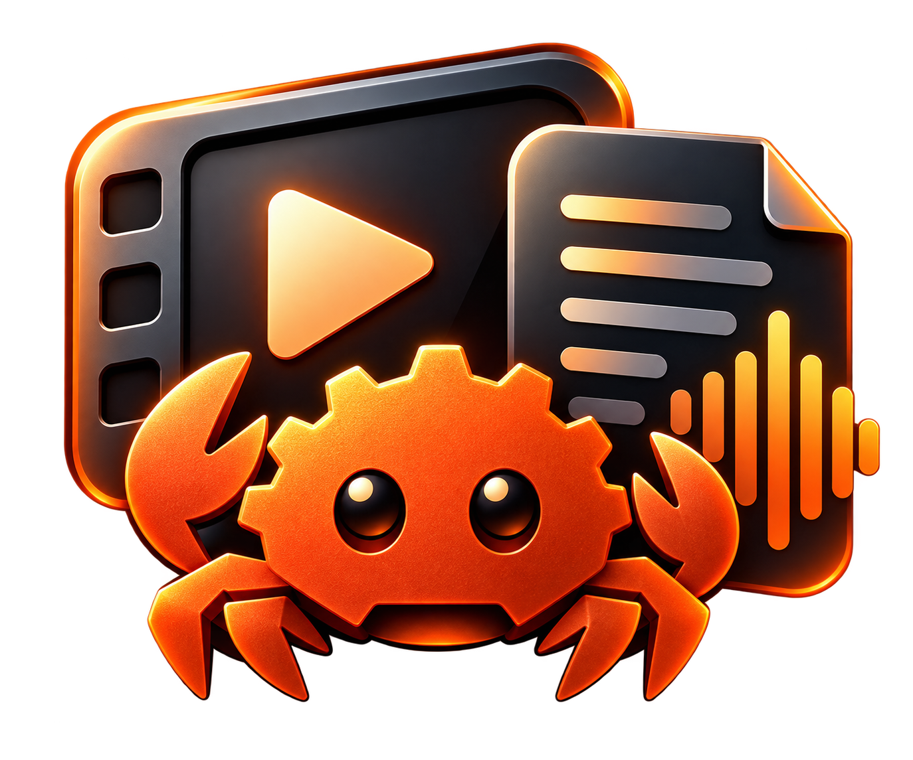

<div align="center">
  <p align="center">
    
  </p>

  [](https://github.com/andreivisan/Rustscribe/actions/workflows/ci.yml)

</div>

# Welcome to Rustscribe

Rustscribe is a native macOS app for turning local video and audio into readable Markdown. Built in Rust with GPUI, with a media shelf inspired by [DropFile](https://dribbble.com/shots/22619137-DropFile-MacOS-App).

## Download for Mac

Download the **unsigned Apple Silicon DMG** from [GitHub Releases](https://github.com/andreivisan/Rustscribe/releases).
The prerelease requires an M1-or-later Mac running **macOS 15 or later**. Drag
Rustscribe into Applications and eject the disk image. Rust and Xcode are not
needed to run the downloaded app.

This build has no Apple Developer ID signature or notarization. If macOS blocks
it, attempt to open it, then use **System Settings → Privacy & Security → Open
Anyway** if you trust the download. See [Apple's instructions](https://support.apple.com/en-us/102445).

Install **FFmpeg** separately (`brew install ffmpeg`) and choose a downloaded
Whisper or Cohere model in Settings. Models and FFmpeg are not included in the
DMG. A `.dmg.sha256` checksum and setup instructions accompany every package.
This release supports Apple Silicon macOS; no Windows, Linux, or Intel Mac
packages are published.

## Run the desktop app

You need Rust, the Xcode command-line tools, CMake, and FFmpeg (`brew install cmake ffmpeg`). Model files stay on your Mac. GPUI compiles its Metal shaders at launch, so the separate Xcode Metal Toolchain download is not required.

```sh
cargo run --release --features desktop --bin rustscribe-desktop
```

You can also pass media paths after `--` to open them on launch:

```sh
cargo run --release --features desktop --bin rustscribe-desktop -- "/path/to/video.webm"
```

Drop files onto the window, or use **Choose files** / **⌘O**. Select Whisper or Cohere, then transcribe the queue or just the selected file. Read and copy the transcript, export Markdown, or use **Save as…** to choose a destination. Existing exports are preserved; quick exports use numbered filenames when needed.

**⌘,** opens settings, **⌘Return** transcribes the queue, and **⌘⇧E** exports completed transcripts. A queue can stop after its current file; an in-progress inference call is not interrupted. The media shelf is session-only, so export transcripts before quitting.

### Local models

- **Whisper:** a whisper.cpp `.bin` model, such as `models/ggml-large-v3-turbo.bin`. Uses Metal on Apple Silicon. [Download models](https://huggingface.co/ggerganov/whisper.cpp/tree/main).
- **Cohere:** an int8 ONNX folder, such as `models/cohere-int8`, containing the encoder, decoder, external weight files, and `tokens.txt`. Uses the CPU with the current transcribe-rs integration. [Download the int8 files](https://huggingface.co/tristanripke/cohere-transcribe-onnx-int8/tree/main).

Models in the project's `models/` directory are discovered automatically. Otherwise choose them in Settings. Model paths, engine choice, and export folder are saved to `~/Library/Application Support/Rustscribe/settings.json`. No media or transcript content is uploaded. Transcription currently uses English and the core API's adaptive audio chunking.

FFmpeg and ffprobe are discovered on `PATH`, then in the standard Apple Silicon and Intel Homebrew locations. For a custom installation set `RUSTSCRIBE_FFMPEG` and `RUSTSCRIBE_FFPROBE` to the executable paths.

### Build a Mac app bundle

```sh
bash scripts/install-release-tools.sh
bash scripts/bundle-macos.sh
open target/Rustscribe.app
```

To create the same DMG used in Releases:

```sh
bash scripts/package-macos.sh
```

The scripts build for Apple Silicon with macOS 15 as the deployment target,
convert the existing artwork to a macOS icon, include dependency notices, and
verify the bundle and mounted disk image. Packages and SHA-256 files are written
to `target/releases/`. The app has an ad-hoc signature; it is not signed with a
Developer ID or notarized. See [the release guide](docs/RELEASING.md) for publishing.

If native builds select mismatched Apple SDKs, use a local `.cargo/config.toml` (ignored by Git) with `SDKROOT` pointing to the SDK under your selected Xcode installation. Obtain that path with `xcrun --sdk macosx --show-sdk-path`.

## CLI

The CLI remains the default binary and does not build GPUI:

```sh
cargo run --release -- whisper models/ggml-large-v3-turbo.bin "/path/to/video.webm"
cargo run --release -- cohere models/cohere-int8 "/path/to/video.webm" -o transcripts/video.md
```

## Code layout

- `src/api/`: reusable extraction, chunked transcription, and atomic Markdown export.
- `src/cli.rs`: Clap command-line interface.
- `src/gpui/views.rs`: desktop appearance and interactions.
- `src/gpui/mod.rs`: window, queue state, and native dialogs.
- `src/gpui/worker.rs`: model ownership, media inspection, and export off the UI thread.
- `src/gpui/settings.rs`: model discovery and persisted preferences.

The worker reuses a loaded model for sequential files and releases it before switching engines. This keeps the UI responsive without duplicating large model allocations. Temporary audio and thumbnails are cleaned up automatically.

## Tests and contributing

Contributions are welcome. See [CONTRIBUTING.md](CONTRIBUTING.md) for development
setup, the test layout, and optional real-model checks. CI runs on Apple Silicon
macOS for every push and pull request, covering the API, CLI, and desktop worker
and settings, plus formatting, Clippy, and building both binaries.

```sh
cargo fmt --all -- --check
cargo clippy --locked --all-targets --all-features -- -D warnings
cargo test --locked --all-targets
cargo test --locked --all-targets --all-features
```

The regular suite requires FFmpeg but no model downloads or API keys. It generates
small media fixtures and uses a recording model to test chunking deterministically.
Real Whisper/Cohere smoke tests are opt-in; native UI interactions and
transcription accuracy still need manual checks. The badge above reports the
actual GitHub Actions result.

## License

Rustscribe's source code is licensed under [MIT](LICENSE). Third-party dependencies
and model weights retain their own licenses.
